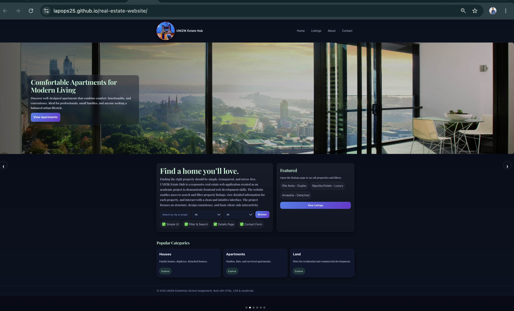
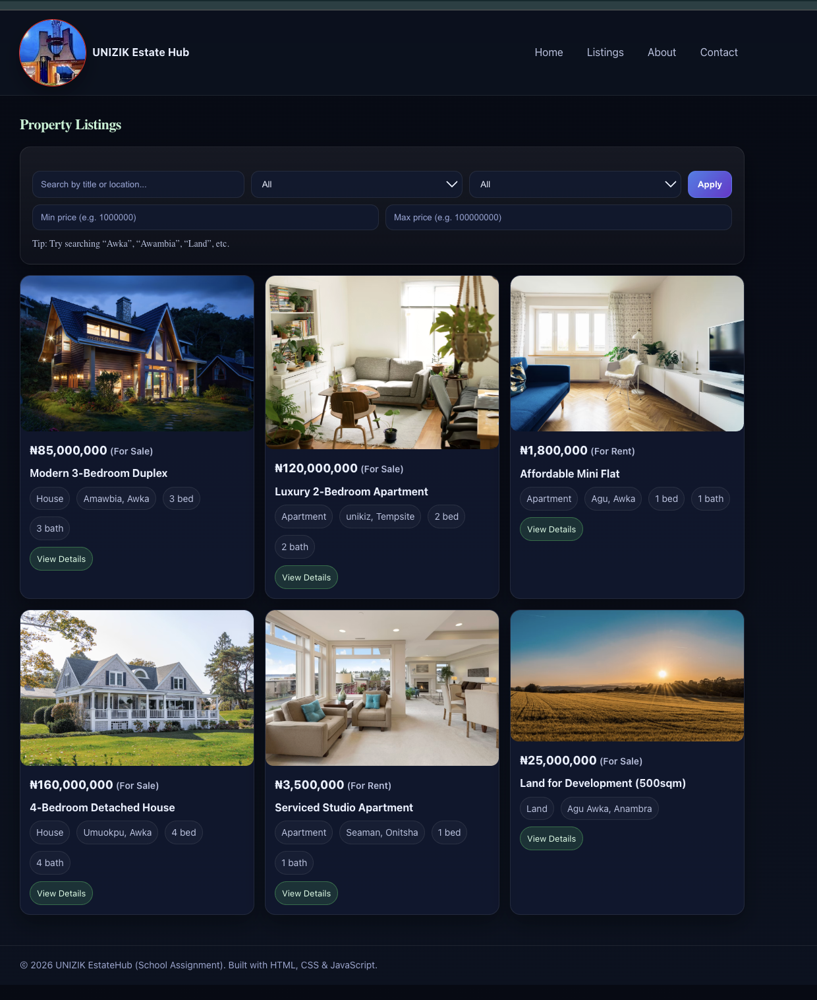

# Real Estate Website

A responsive real estate website built with **HTML5, CSS3, and JavaScript**. The application allows users to browse available properties, view detailed property information, and enjoy a clean, modern user experience.


## Live Demo

 https://lapops25.github.io/real-estate-website/


## Features

- Responsive design for desktop, tablet, and mobile devices
- Dynamic property listings powered by JavaScript
- Property details page with individual property information
- Modular project structure for better code organization
- Separate data layer using `data.js`
- About and Contact pages
- Clean, modern, and user-friendly interface
- Easy to maintain and extend

##  Screenshots

### Home Page



### Property Listings




## Technologies Used

- HTML5
- CSS3
- JavaScript (ES6)


## Project Structure

```
real-estate-website/
│
├── assets/
│   ├── css/
│   ├── img/
│   └── js/
│       ├── app.js
│       └── data.js
│
├── index.html
├── listings.html
├── property.html
├── about.html
├── contact.html
└── README.md
```


## Installation

Clone the repository:

```bash
git clone https://github.com/lapops25/real-estate-website.git
```

Navigate to the project folder:

```bash
cd real-estate-website
```

Open `index.html` in your preferred web browser.


##  Future Improvements

- Property search and filtering
- User authentication
- Favorites/Bookmark feature
- Backend integration
- Database support
- Admin dashboard
- Google Maps integration


## Author

**Augustine Okpalaezennia**

GitHub: https://github.com/lapops25

LinkedIn:
https://www.linkedin.com/in/augustine-okpalaezennia-608123286/